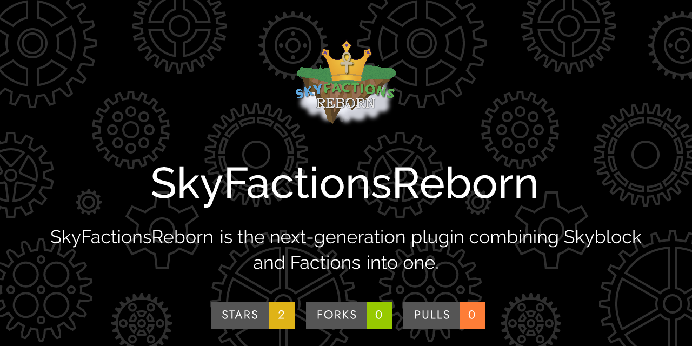

\
\
This plugin elegantly merges features from Skyblock and Factions. Skyblock, even when played on a big network, can get
quite lonely. That's why we combined it with Factions and expanded on the gamemode tenfold. This seemed like an obvious
synthesis to explore. This plugin has several dependencies, comes with **MANY** features, but everything is laid out
intuitively for the server owner.

## Features

This plugin contains an abundance of smart features, including:

- Advanced raid mechanics, placeholders, and rewards
- Player island and faction island generation; hooks nicely with a world manager like MyWorlds
- Custom unique currency system called "gems" and a provided (optional) resource pack for them
- Much, much more

## Links

- [Discord](https://discord.gg/Y7DVR9gpwa) - For general questions, support, and chatting about the plugin. For bug
  reports, use Github issues.
- [Torrent Network](https://www.torrentsmp.com) - The first server to use this plugin!
- [Documentation](https://docs.terrabytedev.com) - Extensive documentation for the plugin.
